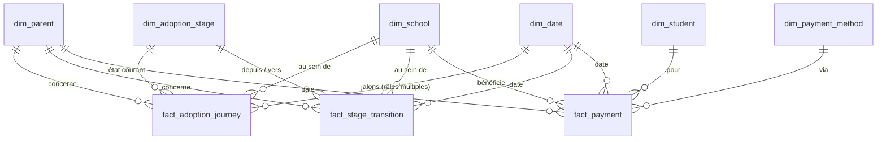

# Conception de la base analytique

> Document d'architecture. Aucune migration ni modèle n'est dérivé de ce document
> tant que les décisions ouvertes en fin de page ne sont pas tranchées.

## Principe directeur

EAC n'est pas une copie d'EcolePay. C'est un **entrepôt analytique** alimenté par
EcolePay, dont la mission est de répondre vite à des questions d'adoption.

Trois conséquences structurantes :

1. **Deux lignées de données coexistent.** Les écoles, parents, élèves et paiements
   sont *synchronisés* : EcolePay en est la source de vérité, EAC ne les crée ni ne
   les supprime — ce que la matrice de permissions traduit déjà. Les campagnes, les
   rapports, les analyses IA et les utilisateurs sont *natifs* : EAC en est
   propriétaire. Ces deux lignées ne se restaurent, ne se purgent et ne se
   sauvegardent pas de la même façon.

2. **Les états d'adoption sont une machine à états, pas un attribut.** Un parent
   peut régresser puis se réactiver. On stocke donc à la fois l'état courant
   (lecture rapide) et l'historique des transitions (cohortes, vélocité).

3. **Deux des six états n'existent pas dans les données sources.** « À risque » et
   « perdu » ne sont jamais annoncés par un événement EcolePay : ce sont des
   *déductions* produites par une règle d'inactivité. Cette règle est un paramètre
   métier qui changera, et tout état déduit doit porter la version de règle qui
   l'a produit.

---

## Le cœur du schéma

`fact_adoption_journey` est la table de travail : la majorité des tableaux de bord
la lisent seule. `fact_stage_transition` porte l'histoire. `fact_payment` porte
l'argent, qui est le fait déclencheur de la conversion.

---

## 1. Tables de dimensions

> Spécification détaillée — colonnes, types, clés, index et contraintes :
> [`dimensions.md`](dimensions.md).

### `dim_date`

**Objectif.** Rendre toute question temporelle exprimable sans calcul de dates.

**Contenu.** Une ligne par jour, pré-remplie sur ~10 ans. Date, jour, semaine, mois,
trimestre civil, année. Et surtout les attributs propres au secteur scolaire :
**année scolaire** (qui ne commence pas en janvier), **trimestre scolaire**,
période de rentrée, période de paiement, vacances, jour férié.

**Pourquoi c'est important ici.** Les paiements scolaires sont massivement
saisonniers. Sans année et trimestre scolaires en dimension, chaque comparaison
« ce trimestre vs le précédent » devient une requête à écrire à la main, et les
comparaisons annuelles glissent d'un mois.

**Relations.** Toutes les tables de faits. Souvent plusieurs fois depuis la même
table (voir *dimensions à rôles multiples* plus bas).

---

### `dim_school`

**Objectif.** Décrire l'école et permettre les regroupements géographiques et
commerciaux.

**Contenu.** Clé de substitution, identifiant EcolePay, nom, région / ville /
commune, type (public, privé, confessionnel), tranche d'effectif, nombre d'élèves,
date de mise en service EcolePay, formule contractuelle, statut (active, suspendue,
partie), et le **commercial référent** — une référence vers la table `users` d'EAC.

**Pourquoi le commercial référent.** C'est ce qui permettra au rôle Commercial de
ne voir que son portefeuille. Sans ce champ, la permission `schools.view` est
binaire : tout ou rien.

**Historisation.** Type 2 recommandé. Une école qui change de formule ou de
commercial ne doit pas réécrire son passé : un KPI de mars doit rester rattaché à
la formule de mars.

**Relations.** Toutes les tables de faits.

---

### `dim_parent`

**Objectif.** Décrire la personne, indépendamment de son compte EcolePay.

**Contenu.** Clé de substitution, identifiant EcolePay **nullable**, empreinte du
numéro normalisé, nom, date de création du compte, langue, canal préféré, dernière
version d'application vue, consentements (marketing, RGPD).

**Le point délicat.** L'identifiant EcolePay est *nullable* par construction : un
« parent connu » est un numéro présent dans la liste d'une école qui n'a **pas
encore** de compte. Cette dimension est donc plus large que la table des
utilisateurs EcolePay. C'est précisément ce qui rend le premier étage de
l'entonnoir mesurable — et c'est l'erreur classique de ne peupler cette dimension
qu'à l'inscription, ce qui rend le taux de conversion structurellement faux.

**Identité.** La clé naturelle est le numéro de téléphone, qui est instable : il
change, il est réattribué, un foyer peut en partager un. Prévoir une table de
correspondance (voir `source_entity_map`) et ne jamais utiliser le numéro comme clé
de jointure directe.

**Confidentialité.** C'est la seule table réellement porteuse de données
personnelles. Stocker le minimum, joindre sur l'empreinte plutôt que sur le numéro
en clair, et garder à l'esprit que `parents.export` sort des données nominatives
hors de la plateforme.

**Relations.** `fact_adoption_journey`, `fact_stage_transition`, `fact_payment`,
`fact_parent_activity`, `fact_campaign_delivery`, `ai_prediction`.

---

### `dim_student`

**Objectif.** Relier un parent à une école, et permettre l'analyse par niveau.

**Contenu.** Identifiant EcolePay, école, niveau / classe, année scolaire, statut
(inscrit, parti, diplômé), lien vers le ou les parents responsables.

**Rôle structurel.** C'est l'élève qui relie le parent à l'école, pas une relation
directe. Un parent peut avoir des enfants dans deux écoles ; sans cette table, un
tel parent fausse les taux d'adoption des deux établissements.

**Relations.** `dim_parent`, `dim_school`, `fact_payment`.

---

### `dim_adoption_stage`

**Objectif.** Donner un sens ordonné et affichable aux six états.

**Contenu.** Six lignes. Code, libellé, **rang** (1 à 6), définition, indicateur
« état converti » (adoptant et au-delà), indicateur « état terminal », couleur
d'affichage.

**Pourquoi une dimension plutôt qu'une énumération de code.** Le rang porte l'ordre
de l'entonnoir, qui est une information analytique : c'est lui qui permet de
détecter une régression sans coder la logique dans chaque requête. Le libellé et la
définition alimentent directement les rapports exportés.

**Relations.** `fact_adoption_journey` (état courant), `fact_stage_transition`
(état de départ **et** état d'arrivée — dimension à rôles multiples).

---

### `dim_adoption_rule_version`

**Objectif.** Versionner la règle qui produit « à risque » et « perdu ».

**Contenu.** Numéro de version, date d'entrée en vigueur, seuil d'inactivité pour
« à risque » (en jours), seuil pour « perdu », événements comptés comme activité,
auteur de la modification.

**Pourquoi une table dédiée.** Le jour où le seuil passe de 60 à 90 jours, tous les
états déduits changent de sens. Sans version enregistrée, un graphique de l'évolution
du nombre de parents à risque devient ininterprétable : on ne sait plus si la courbe
reflète le comportement des parents ou un changement de définition.

**Relations.** `fact_stage_transition`, `fact_school_daily_snapshot`.

---

### `dim_campaign`

**Objectif.** Décrire une campagne d'activation.

**Contenu.** Nom, objectif, définition du segment ciblé, canal, modèle de message,
statut, dates de début et de fin, créateur (utilisateur EAC), coût prévisionnel.

**Lignée native.** Contrairement aux dimensions précédentes, celle-ci n'est pas
synchronisée : elle naît dans EAC. Elle porte donc des règles de validation
applicatives, pas seulement des données importées.

**Relations.** `fact_campaign_delivery`, `agg_campaign_performance`, `users`.

---

### `dim_channel`

**Objectif.** Distinguer les canaux et permettre le calcul du coût.

**Contenu.** SMS, WhatsApp, e-mail, notification push, message intégré. Fournisseur,
**coût unitaire**, délai de remise moyen.

**Pourquoi le coût unitaire ici.** Sans lui, aucun retour sur investissement de
campagne n'est calculable. Le SMS et WhatsApp n'ont pas le même prix, et c'est
souvent ce qui départage deux campagnes de performance apparemment identique.

**Relations.** `fact_campaign_delivery`, `dim_campaign`.

---

### `dim_payment_method`

**Objectif.** Analyser l'adoption par moyen de paiement.

**Contenu.** Libellé, fournisseur, catégorie (mobile money, carte, virement,
espèces), indicateur numérique, structure de frais.

**Intérêt analytique.** Le moyen de paiement disponible est fréquemment le facteur
bloquant de la première conversion. Croiser « parents inscrits non adoptants » avec
les moyens proposés par leur école est une analyse à forte valeur.

**Relations.** `fact_payment`.

---

### `dim_event_type`

**Objectif.** Qualifier les événements d'usage sans multiplier les colonnes.

**Contenu.** Code, libellé, catégorie (consultation, transaction, communication,
support), **indicateur « compte comme activité »**.

**Pourquoi le dernier champ.** C'est lui qui définit l'engagement. Ouvrir une
notification n'a pas le même poids que consulter une facture. Le rendre explicite
en dimension permet de faire évoluer la définition de l'engagement sans réécrire
les traitements.

**Relations.** `fact_parent_activity`.

---

## 2. Tables de faits

> Spécification détaillée — grain, colonnes, clés, index, fréquence et source :
> [`facts.md`](facts.md).

### `fact_adoption_journey` — instantané cumulatif

**Objectif.** Répondre en une seule lecture à la quasi-totalité des questions
d'entonnoir.

**Grain.** Un parent × une école. *(voir décision ouverte n° 1)*

**Contenu.** Les jalons, sous forme de dates : date de connaissance, d'inscription,
de premier paiement, de dernière activité, de passage à risque, de perte, de
réactivation. Puis les mesures dérivées : délai connu → inscrit, délai inscrit →
premier paiement, **délai total d'adoption**, nombre de paiements, montant cumulé,
jours depuis la dernière activité. Enfin l'état courant.

**Particularité.** C'est une ligne qui se **met à jour** plutôt que de s'insérer —
un instantané cumulatif au sens de Kimball. Elle grandit avec le nombre de couples
parent-école, pas avec le temps.

**Ce qu'elle permet immédiatement.** Comptage par état, taux de conversion entre
étages, délai moyen de conversion, distribution des délais, écoles en retard
d'adoption. Sans jointure sur les faits d'événements.

**Relations.** `dim_parent`, `dim_school`, `dim_adoption_stage`, `dim_date` (une
référence par jalon).

---

### `fact_stage_transition` — fait transactionnel

**Objectif.** Conserver l'histoire des changements d'état.

**Grain.** Une transition.

**Contenu.** Parent, école, état de départ, état d'arrivée, date et horodatage,
**nature du déclencheur** (paiement, règle d'inactivité, synchronisation, correction
manuelle), référence de l'événement source, version de règle appliquée.

**Ce qu'elle permet et que l'instantané ne permet pas.** Les cohortes (« parmi les
inscrits de mars, combien ont converti à 30, 60, 90 jours »), la vélocité de
l'entonnoir, et surtout les **réactivations** — un parent revenu d'un état à risque
est un signal opérationnel fort, invisible si l'on ne regarde que l'état courant.

**Point de vigilance.** La nature du déclencheur n'est pas décorative : une
transition vers « à risque » produite par un traitement planifié n'a pas la même
fiabilité qu'une transition vers « adoptant » produite par un paiement constaté.
Les distinguer évite d'imputer à un parent un comportement qui n'est qu'un effet de
seuil.

**Relations.** `dim_parent`, `dim_school`, `dim_adoption_stage` (deux fois),
`dim_date`, `dim_adoption_rule_version`.

---

### `fact_payment`

**Objectif.** Porter le fait qui définit la conversion.

**Grain.** Une transaction de paiement.

**Contenu.** Parent, école, élève, date, moyen de paiement, montant, devise, frais,
statut, indicateur **premier paiement**, référence de la transaction source,
échéance ou tranche concernée.

**Inclure les échecs.** Un premier paiement échoué est le signal le plus
actionnable de toute la plateforme : un parent qui a essayé de payer et n'y est pas
parvenu est à un geste de la conversion. Ne conserver que les paiements réussis
priverait le Commercial et le Support de leur meilleure liste d'appels.

**Relations.** `dim_parent`, `dim_school`, `dim_student`, `dim_date`,
`dim_payment_method`.

---

### `fact_parent_activity`

**Objectif.** Mesurer l'usage réel, qui fonde les états « engagé », « à risque » et
« perdu ».

**Grain.** Un événement d'usage.

**Contenu.** Parent, école, date, type d'événement, horodatage, contexte technique
minimal (plateforme, version).

**La table volumineuse du schéma.** C'est la seule dont le volume croît avec l'usage
et non avec la population. Elle appelle un partitionnement mensuel et une politique
de rétention explicite : conserver le détail sur une fenêtre glissante (13 mois
permet la comparaison annuelle), et ne garder au-delà que les agrégats.

**Relations.** `dim_parent`, `dim_school`, `dim_date`, `dim_event_type`.

---

### `fact_campaign_delivery`

**Objectif.** Suivre chaque message et permettre l'attribution.

**Grain.** Un message × un parent.

**Contenu.** Campagne, parent, canal, dates d'envoi, de remise, d'ouverture, de clic,
motif d'échec, coût réel, état d'adoption du parent **au moment de l'envoi**.

**Pourquoi figer l'état à l'envoi.** Sans lui, impossible de dire plus tard si la
campagne visait juste : l'état du parent aura changé, éventuellement grâce à la
campagne elle-même. C'est la seule façon de mesurer un ciblage.

**Relations.** `dim_campaign`, `dim_parent`, `dim_channel`, `dim_date`.

---

### `fact_school_daily_snapshot` — instantané périodique

**Objectif.** Rendre les courbes de tendance instantanées et immuables.

**Grain.** Une école × un jour.

**Contenu.** Effectif par état (six colonnes), parents actifs, nouvelles
inscriptions, nouveaux adoptants, pertes du jour, nombre et montant des paiements,
taux d'adoption, version de règle appliquée.

**Pourquoi une photo quotidienne.** Elle protège les historiques des corrections
rétroactives. Si une donnée EcolePay est corrigée trois mois plus tard, la photo du
jour reste le reflet de ce qui était connu ce jour-là — ce qui est exactement ce
qu'on veut pour un rapport déjà diffusé en comité de direction.

**Relations.** `dim_school`, `dim_date`, `dim_adoption_rule_version`.

---

## 3. Tables d'agrégation

> Spécification détaillée — rôle, colonnes, index, cadence et règles de mise à jour :
> [`aggregates.md`](aggregates.md).

Toutes sont **dérivées et reconstructibles**. Aucune n'est source de vérité. Elles
existent pour la vitesse d'affichage, et doivent pouvoir être recalculées sur une
fenêtre glissante — la synchronisation ramène des données en retard, un agrégat
strictement incrémental dérive silencieusement.

### `agg_funnel_daily`

Effectifs et taux de passage par étage, par jour, déclinables par région et par
type d'école. Alimente le graphique d'entonnoir principal.
→ `dim_date`, `dim_school`, `dim_adoption_stage`.

### `agg_school_monthly`

Consolidation mensuelle par école : taux d'adoption, progression, volume de
paiements, rang. Alimente les classements et le suivi de portefeuille commercial.
→ `dim_school`, `dim_date`.

### `agg_cohort_retention`

Cohorte (mois d'inscription) × nombre de mois écoulés → part encore active, part
convertie, part perdue. La table de référence pour répondre à « est-ce que nos
parents restent ».
→ `dim_date`, `dim_school`.

### `agg_campaign_performance`

Par campagne : envoyés, remis, ouverts, cliqués, conversions attribuées, coût total,
coût par conversion. *(voir décision ouverte n° 4 sur la fenêtre d'attribution)*
→ `dim_campaign`, `dim_channel`.

### `agg_kpi_snapshot`

Les quelques nombres de l'en-tête du tableau de bord, pré-calculés : taux
d'adoption national, parents actifs, volume du mois, variation. Une poignée de
lignes, lue à chaque chargement de page.
→ `dim_date`.

---

## 4. Tables IA

> Spécification détaillée — colonnes, relations, conservation et archivage :
> [`ai-tables.md`](ai-tables.md).

### `ai_analysis`

**Objectif.** Conserver chaque diagnostic généré.

**Contenu.** Portée (nationale, école, campagne, segment), identifiant de la portée,
date, modèle utilisé, version du prompt, **instantané des données d'entrée**, texte
produit, sortie structurée, indice de confiance, jetons consommés, coût, demandeur.

**Le champ qui compte : l'instantané des entrées.** Une recommandation doit rester
explicable six mois plus tard, alors que les données auront changé. Sans les
métriques exactes qui l'ont produite, un diagnostic devient une affirmation
invérifiable — ce qui est exactement ce qu'on ne veut pas présenter en comité.

**Relations.** `dim_school`, `dim_campaign`, `users`, `ai_recommendation`.

---

### `ai_recommendation`

**Objectif.** Transformer un diagnostic en action suivie.

**Contenu.** Analyse d'origine, cible, type d'action, priorité, justification,
impact attendu, statut (nouvelle, acceptée, rejetée, réalisée), responsable,
**résultat constaté**.

**Boucle de retour.** Le statut et le résultat sont ce qui distingue un assistant
d'un générateur de texte : ils permettent de mesurer si les recommandations
produisent réellement de l'adoption, et d'écarter celles qui n'en produisent pas.

**Relations.** `ai_analysis`, `dim_school`, `users`.

---

### `ai_prediction`

**Objectif.** Porter les scores calculés par lot.

**Grain.** Un parent (ou une école) × un cycle de calcul.

**Contenu.** Cible, risque de départ, propension à convertir, délai de conversion
estimé, principaux facteurs explicatifs, version du modèle, date de calcul.

**Conserver l'historique.** Écraser le score précédent rend impossible toute mesure
de justesse : évaluer un modèle suppose de comparer ce qu'il prédisait *avant* à ce
qui s'est produit *après*. Une table qui ne garde que le score courant ne s'audite
pas.

**Relations.** `dim_parent`, `dim_school`, `fact_adoption_journey`.

---

### `ai_feedback`

**Objectif.** Recueillir le jugement humain sur une production IA.

**Contenu.** Élément concerné, utilisateur, jugement d'utilité, commentaire, date.

**Relations.** `ai_analysis`, `ai_recommendation`, `users`.

---

### `ai_generation_log`

**Objectif.** Maîtriser le coût et diagnostiquer les incidents.

**Contenu.** Toute invocation du modèle : modèle, jetons entrants et sortants,
latence, coût, statut, erreur, nombre de tentatives.

**Distinct d'`ai_analysis`.** Les appels en échec et les reprises n'ont pas produit
d'analyse mais ont produit un coût. Les loger à part évite de polluer la table
métier tout en gardant la facture lisible.

---

## 5. Tables techniques — non demandées, mais nécessaires

Ces tables ne relèvent pas du schéma en étoile. Sans elles, l'entrepôt n'est pas
fiable : rien ne permet de savoir si un chiffre affiché repose sur des données
fraîches, partielles ou périmées.

### `sync_run`

Chaque exécution de synchronisation : source, entité, début, fin, lignes lues,
insérées, mises à jour, rejetées, statut, erreur. Permet d'afficher « données à jour
au … » sur les tableaux de bord — la première question que pose un dirigeant devant
un chiffre surprenant.

### `sync_watermark`

Dernier repère synchronisé avec succès, par entité. Rend la synchronisation
incrémentale et reprenable après incident.

### `sync_reject`

Lignes refusées avec leur motif. Une donnée invalide doit être **visible**, pas
silencieusement ignorée : un rejet non tracé se manifeste plus tard sous forme d'un
taux d'adoption inexplicablement bas.

### `source_entity_map`

Correspondance entre clés naturelles EcolePay et clés de substitution EAC, avec
première et dernière apparition. C'est ce qui absorbe les changements de numéro de
téléphone et les fusions de doublons sans casser l'historique.

### `audit_log`

Journal des actions sensibles réalisées dans EAC — exports, envois de campagne,
modifications de rôles et de paramètres. La permission `audit.view` existe déjà dans
la matrice ; il lui faut sa table.

---

## Points de conception transverses

**Dimensions à rôles multiples.** `fact_adoption_journey` référence `dim_date` sept
fois et `fact_stage_transition` référence `dim_adoption_stage` deux fois. C'est
normal et voulu : chaque référence porte un rôle distinct (date d'inscription, date
de perte…). À nommer explicitement dès la conception, faute de quoi les requêtes
deviennent illisibles.

**Clés de substitution partout.** Aucune jointure sur un identifiant EcolePay ni sur
un numéro de téléphone. Les clés sources changent, fusionnent et se réattribuent ;
les clés internes non.

**Reconstruction possible.** Faits et agrégats doivent pouvoir être recalculés
depuis les données synchronisées sur une fenêtre glissante. Les seules données
irremplaçables sont les données natives : campagnes, analyses IA, retours
utilisateurs, journal d'audit. Ce sont elles qui commandent la stratégie de
sauvegarde.

**Volumétrie.** Les dimensions et `fact_adoption_journey` croissent avec la
population. `fact_parent_activity` et `fact_campaign_delivery` croissent avec
l'usage : ce sont les deux seules à partitionner et à soumettre à rétention.

---

## Décisions à trancher avant toute migration

**1. Grain de l'adoption : par parent, ou par parent et par école ?**
Un parent ayant des enfants dans deux écoles peut avoir payé dans l'une et pas dans
l'autre. Au grain « parent », les KPI par école deviennent faux. Au grain « parent ×
école », le taux d'adoption national exige une déduplication explicite.
*Recommandation : parent × école.* Le chiffre national est une agrégation, l'inverse
n'est pas vrai — un grain trop grossier est irrattrapable sans reconstruction.

**2. Quels seuils pour « à risque » et « perdu » ?**
Combien de jours sans activité ? Et quels événements comptent comme activité — une
connexion suffit-elle, ou faut-il un acte de valeur ? Ces deux réponses définissent
deux des six états de l'entonnoir.

**3. Quel niveau de données personnelles dans EAC ?**
Les noms et numéros sont-ils nécessaires à l'analyse, ou seulement à l'action
commerciale et au support ? Une pseudonymisation partielle réduirait fortement
l'exposition, mais rendrait `parents.export` inutilisable pour le Commercial.

**4. Quelle fenêtre d'attribution des campagnes ?**
Si un parent convertit 20 jours après un SMS, la campagne en est-elle la cause ?
Sans règle explicite, tout retour sur investissement de campagne est arbitraire.

**5. Quelle fraîcheur attendue ?**
Synchronisation quotidienne nocturne, ou continue ? Cela détermine si les agrégats
peuvent être calculés une fois par nuit ou doivent être rafraîchis en continu — un
choix qui change l'architecture des traitements, pas seulement leur fréquence.

**6. Quels ordres de grandeur ?**
Nombre d'écoles, de parents, d'événements d'usage par jour. En dessous de quelques
millions de lignes, MySQL suffit sans partitionnement et une partie des agrégats est
prématurée. Au-delà, le partitionnement de `fact_parent_activity` devient structurant
et doit être décidé maintenant.
